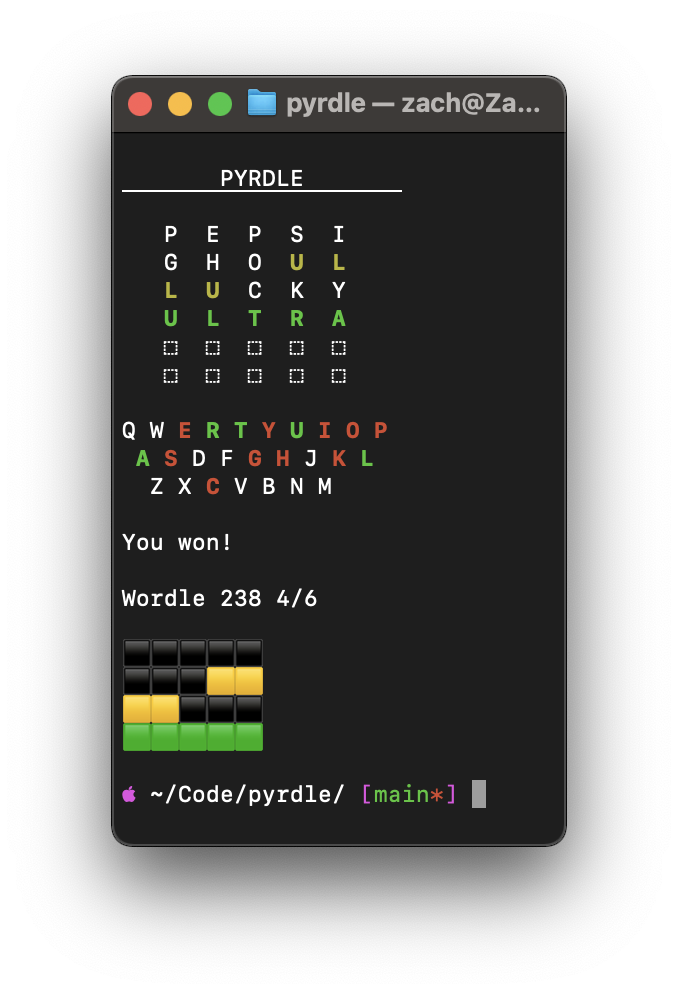

<h1 align="center">PYRDLE</h1>

Wordle in your terminal. Written in Python.

<h3 align="center">🟩🟨⬛️</h3>

Uses the <a href="https://www.powerlanguage.co.uk/wordle/main.c1506a22.js" alt="Link to the wordle javascript file">Official Wordle Word List</a> <em>*Spoiler Warning!*</em> which is retrieved at app start.   
Don't worry, <strong>you'll be playing the same word as your friends!</strong>

 
<h3 align="center">🛠 Built With 🛠</h3>

  <a href="https://docs.python-requests.org/en/latest/">requests</a>
   
  <a href="https://github.com/asweigart/pyperclip">pyperclip</a>

